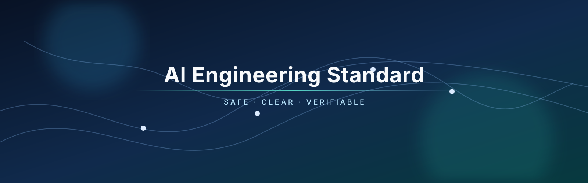

  

  <a href="README.md">English</a> · <a href="README.ru.md">Русский</a>

# AI Engineering Standard

Стандарт инженерной работы с ИИ.

Независимый от модели набор правил для безопасной, сфокусированной, поддерживаемой и проверяемой разработки. Он рассчитан на совместную работу ИИ-агентов и людей в одном репозитории.

## Назначение репозитория

Главный документ — [INSTRUCTIONS.md](INSTRUCTIONS.md). Он превращает общие требования к качеству в практические правила:

- определение границ задачи и разрешение конфликтов инструкций;
- защита от небезопасных указаний во внешнем или недоверенном контенте;
- небольшие, понятные и проверяемые изменения;
- проверка обычных, граничных, ошибочных, безопасностных и совместимых сценариев;
- безопасная работа с миграциями, наблюдаемостью, временными инструментами и внешними действиями.

## Быстрый старт

1. Перед изменением файлов прочитайте [INSTRUCTIONS.md](INSTRUCTIONS.md).
2. При необходимости ознакомьтесь с политиками участия, безопасности и поведения ниже.
3. Храните временные артефакты агентов в `temp/` и не добавляйте их в Git.
4. Используйте формы issue и шаблон pull request из `.github/`, когда каталог станет GitHub-репозиторием.
5. Перед публичным выпуском замените шаблонные решения по управлению и контактам на утверждённые владельцем проекта.

## Структура репозитория

| Расположение | Назначение |
| --- | --- |
| [INSTRUCTIONS.md](INSTRUCTIONS.md) | Основной стандарт работы для агентов и участников. |
| [INSTRUCTIONS.ru.md](INSTRUCTIONS.ru.md) | Русская локализация основного стандарта работы. |
| [CONTRIBUTING.md](CONTRIBUTING.md) | Процесс внесения изменений и ожидания от ревью. |
| [SECURITY.md](SECURITY.md) | Ответственное сообщение об уязвимостях и порядок реакции. |
| [CODE_OF_CONDUCT.md](CODE_OF_CONDUCT.md) | Правила совместной работы и порядок их применения. |
| [SUPPORT.md](SUPPORT.md) | Получение помощи и сообщение о незащитных проблемах. |
| [GOVERNANCE.md](GOVERNANCE.md) | Принятие решений мейнтейнерами и управление изменениями. |
| [CHANGELOG.md](CHANGELOG.md) | Формат заметок о релизах и история изменений. |
| [.github/](.github/) | Формы issue, шаблон pull request и конфигурация GitHub. |
| [assets/](assets/) | Визуальные ассеты, включая шапку этого README. |

## Локализованная документация

У каждого содержательного документа есть русская версия. Переключатель языка находится в начале файла:

| English | Русский |
| --- | --- |
| [README.md](README.md) | [README.ru.md](README.ru.md) |
| [INSTRUCTIONS.md](INSTRUCTIONS.md) | [INSTRUCTIONS.ru.md](INSTRUCTIONS.ru.md) |
| [CONTRIBUTING.md](CONTRIBUTING.md) | [CONTRIBUTING.ru.md](CONTRIBUTING.ru.md) |
| [SECURITY.md](SECURITY.md) | [SECURITY.ru.md](SECURITY.ru.md) |
| [CODE_OF_CONDUCT.md](CODE_OF_CONDUCT.md) | [CODE_OF_CONDUCT.ru.md](CODE_OF_CONDUCT.ru.md) |
| [SUPPORT.md](SUPPORT.md) | [SUPPORT.ru.md](SUPPORT.ru.md) |
| [GOVERNANCE.md](GOVERNANCE.md) | [GOVERNANCE.ru.md](GOVERNANCE.ru.md) |

Обе языковые версии должны выражать одну политику. Если переводы расходятся по смыслу, английская версия действует до исправления несоответствия мейнтейнерами.

## Что требует решения владельца

Шаблон намеренно не выдумывает юридически и операционно значимые сведения. Перед публикацией владельцу проекта следует добавить:

- приватный канал для сообщений об уязвимостях или включить private vulnerability reporting в GitHub;
- именованных мейнтейнеров и правила одобрения изменений, если они отличаются от установленных по умолчанию;
- funding-файл, CODEOWNERS, CI, процесс релизов и автоматизацию зависимостей — только если они действительно нужны.

## Лицензия

Проект распространяется по [Apache License 2.0](LICENSE). Она разрешает использование, изменение и распространение на её условиях, включая сохранение обязательных уведомлений и патентные положения.
